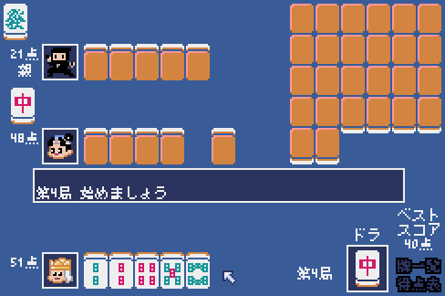

# ミニ麻雀

[すずめ雀](https://sugorokuya.jp/p/suzume-jong)を参考にしました。

## 操作方法

* 最初に「牌一覧」、「得点表」が表示されてゲーム開始となります。
* 自動的にツモるので、捨てたい牌を選択します。
* 「ツモ」や「ロン」が表示され、それを選択するとアガリとなります。

## ルール

* １ゲームは12局で、初期の所持得点は各50点です。
* 手牌は５枚で、順に１枚引いて、１枚捨てます。
* ３枚２組の役を完成させ、5点以上であればアガることができます。
  * 相手の捨てた牌でロンアガリできます。
  * ツモアガリは、他者２人から得点を２で割った数（端数切り上げ）をそれぞれ受け取ります。
  * ロンアガリは、牌を捨てた者から得点を受け取る。
* ドラは現物。ポン、チー、カン、リーチ、ダブロンは無しです。

## プログラム

* 日本語フォントは、[8×8ドット日本語フォント「美咲フォント」](https://littlelimit.net/misaki.htm)を使用しました。
* ドット絵アイコンは、[ピクセルガロー](https://hpgpixer.jp/)を使用しました。
